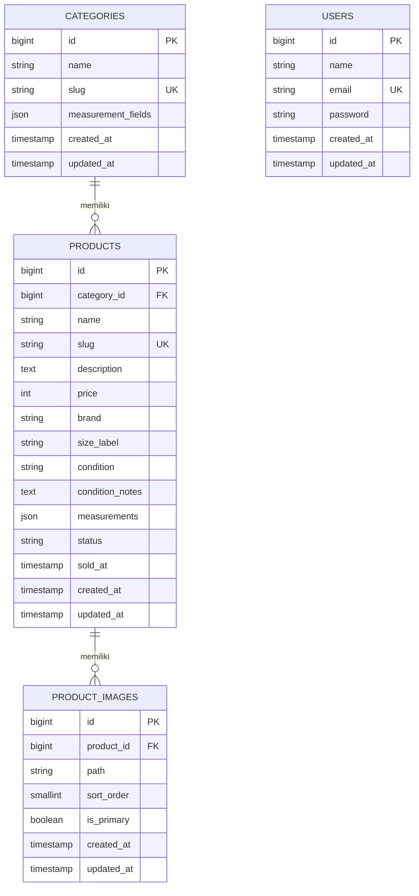
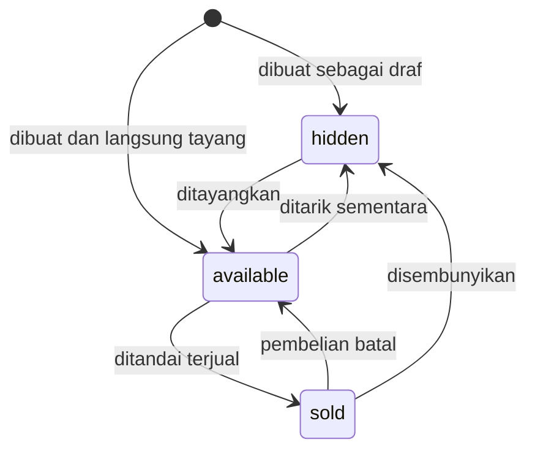

# PakeLagi API — ERD dan Kamus Data

| | |
|---|---|
| **Versi dokumen** | 0.1 (Draft) |
| **Tanggal** | 4 Oktober 2026 |
| **Database** | MySQL (`utf8mb4`) |
| **Dokumen terkait** | [Requirements](./requirements.md) · [User Flow](./user-flow.md) |

Diagram di bawah memakai Mermaid, yang tampil otomatis di GitHub.

## 1. Entity Relationship Diagram



`USERS` berdiri sendiri (tidak berelasi dengan tabel toko) karena hanya dipakai untuk akun admin. Tabel `personal_access_tokens` dari Laravel Sanctum, serta tabel bawaan Laravel lain (`sessions`, `cache`, `jobs`, dan sebagainya), tidak digambarkan karena dikelola framework.

## 2. Relasi

| Relasi | Kardinalitas | Perilaku saat hapus |
|---|---|---|
| `categories` → `products` | satu kategori punya banyak produk; satu produk milik tepat satu kategori | **Restrict**: kategori yang masih punya produk tidak bisa dihapus |
| `products` → `product_images` | satu produk punya banyak foto; satu foto milik tepat satu produk | **Cascade**: hapus produk menghapus baris fotonya. File di storage dihapus lewat kode aplikasi |

## 3. Kamus Data

### 3.1 `categories`

| Kolom | Tipe | Constraint | Keterangan |
|---|---|---|---|
| `id` | bigint unsigned | PK, auto increment | |
| `name` | varchar(255) | NOT NULL | Nama kategori, misalnya "Atasan" |
| `slug` | varchar(255) | NOT NULL, UNIQUE | Dipakai di URL dan filter |
| `measurement_fields` | json | NOT NULL | Daftar jenis ukuran yang relevan untuk kategori ini |
| `created_at`, `updated_at` | timestamp | NULL | Diisi otomatis oleh Laravel |

Contoh `measurement_fields`:

```json
["lebar_dada", "panjang_baju", "panjang_lengan"]
```

Kategori awal yang akan diisi lewat seeder:

| Kategori | Contoh `measurement_fields` |
|---|---|
| Atasan | `lebar_dada`, `panjang_baju`, `panjang_lengan` |
| Bawahan | `lingkar_pinggang`, `panjang`, `lebar_paha` |
| Outer | `lebar_dada`, `panjang`, `panjang_lengan`, `lebar_bahu` |
| Aksesori | dimensi seperlunya, boleh kosong |

### 3.2 `products`

| Kolom | Tipe | Constraint | Keterangan |
|---|---|---|---|
| `id` | bigint unsigned | PK, auto increment | |
| `category_id` | bigint unsigned | FK → `categories.id`, NOT NULL, ON DELETE RESTRICT | |
| `name` | varchar(255) | NOT NULL | |
| `slug` | varchar(255) | NOT NULL, UNIQUE | Dibuat dari nama; dipakai di URL produk |
| `description` | text | NULL | |
| `price` | int unsigned | NOT NULL | Rupiah, tanpa desimal |
| `brand` | varchar(255) | NULL | |
| `size_label` | varchar(255) | NOT NULL | Misalnya S, M, L, XL, All size |
| `condition` | varchar(255) | NOT NULL | Nilai enum `ProductCondition` |
| `condition_notes` | text | NULL | Catatan minus, misalnya "ada noda kecil di lengan" |
| `measurements` | json | NULL | Nilai ukuran dalam cm, kunci mengikuti `categories.measurement_fields` |
| `status` | varchar(255) | NOT NULL, DEFAULT `available` | Nilai enum `ProductStatus` |
| `sold_at` | timestamp | NULL | Kosong sampai produk terjual |
| `created_at`, `updated_at` | timestamp | NULL | |

**Indeks:** gabungan (`status`, `category_id`) dan tunggal (`price`), dipakai untuk filter katalog.

Contoh `measurements` untuk kategori atasan:

```json
{ "lebar_dada": 52, "panjang_baju": 70, "panjang_lengan": 60 }
```

### 3.3 `product_images`

| Kolom | Tipe | Constraint | Keterangan |
|---|---|---|---|
| `id` | bigint unsigned | PK, auto increment | |
| `product_id` | bigint unsigned | FK → `products.id`, NOT NULL, ON DELETE CASCADE | |
| `path` | varchar(255) | NOT NULL | Lokasi file di storage |
| `sort_order` | smallint unsigned | NOT NULL, DEFAULT 0 | Urutan tampil di galeri |
| `is_primary` | boolean | NOT NULL, DEFAULT false | Foto utama (maksimal satu per produk, dijaga oleh aplikasi) |
| `created_at`, `updated_at` | timestamp | NULL | |

### 3.4 `users`

Tabel bawaan Laravel, dipakai hanya untuk akun admin. Akun admin dibuat lewat seeder atau perintah artisan, **bukan** lewat registrasi publik.

## 4. Enum

### `ProductStatus`

| Case | Nilai di database | Arti |
|---|---|---|
| `Available` | `available` | Tersedia dan tampil di katalog |
| `Sold` | `sold` | Sudah terjual; tetap bisa dibuka lewat slug |
| `Hidden` | `hidden` | Disembunyikan; tidak tampil di API publik |

### `ProductCondition`

| Case | Nilai di database | Arti |
|---|---|---|
| `LikeNew` | `like_new` | Seperti baru |
| `Good` | `good` | Kondisi baik, tanda pemakaian wajar |
| `Fair` | `fair` | Ada minus yang dijelaskan di `condition_notes` |

## 5. Diagram Status Produk

Transisi status yang diizinkan (usulan; bagian "sold → available" untuk kasus pembelian batal):



## 6. Catatan Desain

- **Tanpa kolom stok.** Setiap barang unik, jadi `status` yang menentukan ketersediaan.
- **Enum disimpan sebagai string**, bukan tipe `ENUM` database. Nilai valid dijaga oleh PHP Enum di kode, sehingga menambah nilai baru tidak butuh perubahan struktur tabel.
- **`measurements` berbentuk JSON** karena jenis ukuran berbeda per kategori; daftar kuncinya ditentukan data (`categories.measurement_fields`), sehingga menambah kategori baru tidak mengubah kode.
- **Harga integer** menghindari masalah pembulatan angka desimal.
- **Wishlist tidak punya tabel**; disimpan di browser pembeli sebagai daftar slug.
- **Pesanan tidak disimpan**; checkout dilakukan lewat pesan WhatsApp yang dibuat frontend.
- **Pertimbangan masa depan (belum dibuat):** kolom harga modal/harga jual aktual, atau tabel pesanan, bila nanti pembayaran online ditambahkan pada tahap 2. Saat tabel pesanan dibuat, harga produk sebaiknya disalin ke pesanan sebagai *snapshot*, sehingga perubahan harga produk tidak memengaruhi pesanan yang sudah ada.