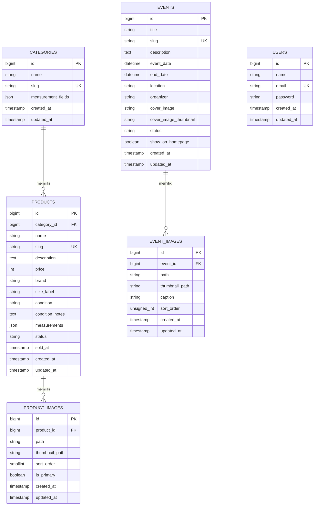
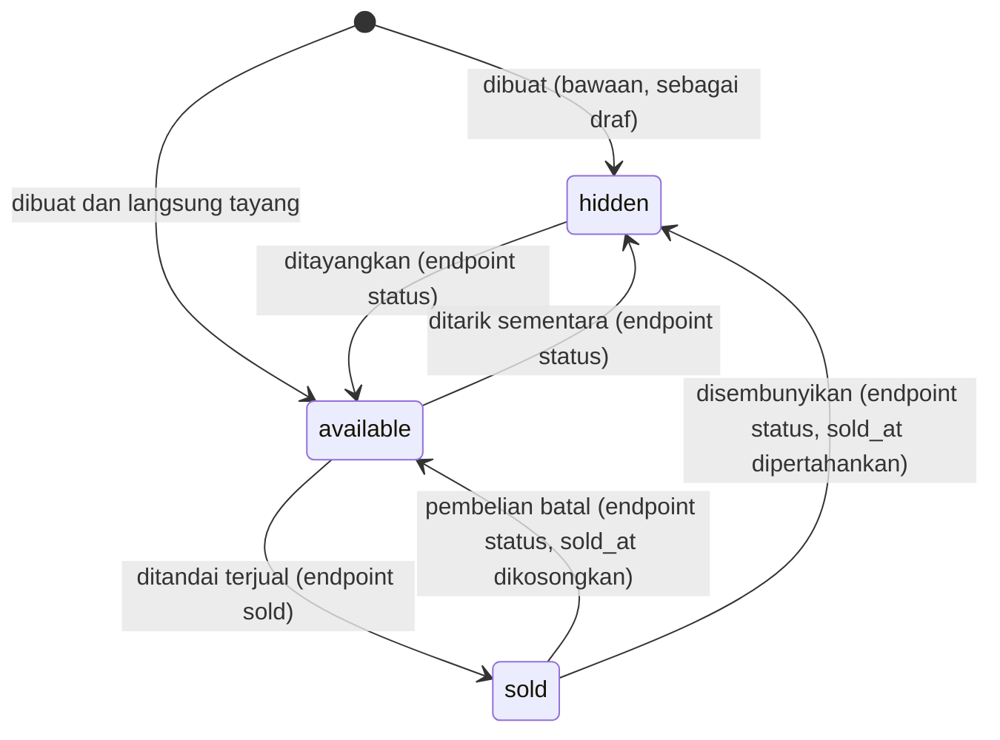

# PakeLagi API — ERD dan Kamus Data

| | |
|---|---|
| **Versi dokumen** | 0.2 (Draft) |
| **Tanggal** | 5 Oktober 2026 |
| **Database** | MySQL (`utf8mb4`) |
| **Dokumen terkait** | [Requirements](./requirements.md) · [User Flow](./user-flow.md) · [Integrasi Frontend](./frontend-integration.md) |

Diagram di bawah memakai Mermaid, yang tampil otomatis di GitHub.

## 1. Entity Relationship Diagram



`USERS` berdiri sendiri (tidak berelasi dengan tabel toko) karena hanya dipakai untuk akun admin.

## 2. Tabel Bawaan Framework

Tabel berikut dibuat oleh migrasi bawaan Laravel dan Sanctum, tidak digambarkan di diagram, dan tidak perlu kita kelola:

| Tabel | Fungsi di proyek ini |
|---|---|
| `sessions` | Menyimpan sesi login admin (autentikasi berbasis cookie) |
| `jobs`, `job_batches`, `failed_jobs` | Antrean (queue): `jobs` menampung job `RevalidateFrontendCache` yang menunggu diproses pekerja; `failed_jobs` menampung job yang gagal permanen |
| `cache`, `cache_locks` | Penyimpanan cache aplikasi; juga dipakai oleh pembatas laju (rate limiting) |
| `password_reset_tokens` | Bawaan Laravel; belum dipakai (tidak ada fitur reset kata sandi) |
| `personal_access_tokens` | Dari Sanctum; tidak terpakai selama login memakai cookie sesi |
| `migrations` | Catatan migrasi yang sudah dijalankan |

## 3. Relasi

| Relasi | Kardinalitas | Perilaku saat hapus |
|---|---|---|
| `categories` → `products` | satu kategori punya banyak produk; satu produk milik tepat satu kategori | **Restrict**: kategori yang masih punya produk tidak bisa dihapus. Aplikasi memeriksa lebih dulu (semua status ikut dihitung) agar pesan errornya jelas |
| `products` → `product_images` | satu produk punya banyak foto; satu foto milik tepat satu produk | **Cascade**: hapus produk menghapus baris fotonya. File di storage dihapus lewat kode aplikasi |

## 4. Kamus Data

### 4.1 `categories`

| Kolom | Tipe | Constraint | Keterangan |
|---|---|---|---|
| `id` | bigint unsigned | PK, auto increment | |
| `name` | varchar(255) | NOT NULL | Nama kategori, misalnya "Atasan". Keunikan dijaga validasi aplikasi, bukan constraint database |
| `slug` | varchar(255) | NOT NULL, UNIQUE | Dibuat dari nama saat kategori dibuat; **tidak berubah** setelahnya |
| `measurement_fields` | json | NOT NULL | Daftar jenis ukuran yang relevan untuk kategori ini; boleh kosong (`[]`), maksimal 12, berformat `snake_case`, tanpa duplikat |
| `created_at`, `updated_at` | timestamp | NULL | Diisi otomatis oleh Laravel |

Contoh `measurement_fields`:

```json
["lebar_dada", "panjang_baju", "panjang_lengan"]
```

Kategori awal yang diisi lewat `CategorySeeder` (aman dijalankan berulang):

| Kategori | `measurement_fields` |
|---|---|
| Atasan | `lebar_dada`, `panjang_baju`, `panjang_lengan` |
| Bawahan | `lingkar_pinggang`, `panjang`, `lebar_paha` |
| Outer | `lebar_dada`, `panjang`, `panjang_lengan`, `lebar_bahu` |
| Aksesori | (kosong) |

### 4.2 `products`

| Kolom | Tipe | Constraint | Keterangan |
|---|---|---|---|
| `id` | bigint unsigned | PK, auto increment | Dipakai di rute admin; API publik memakai `slug` |
| `category_id` | bigint unsigned | FK → `categories.id`, NOT NULL, ON DELETE RESTRICT | |
| `name` | varchar(255) | NOT NULL | |
| `slug` | varchar(255) | NOT NULL, UNIQUE | Dibuat dari nama saat produk dibuat (ditambah `-2`, `-3`, ... bila bentrok); **tidak berubah** walau nama diubah |
| `description` | text | NULL | |
| `price` | int unsigned | NOT NULL | Rupiah, tanpa desimal; maksimal 100.000.000 menurut validasi |
| `brand` | varchar(255) | NULL | |
| `size_label` | varchar(255) | NOT NULL | Teks bebas, misalnya S, M, L, XL, All size (daftar baku masih pertanyaan terbuka) |
| `condition` | varchar(255) | NOT NULL | Nilai enum `ProductCondition` |
| `condition_notes` | text | NULL | Catatan minus, misalnya "ada noda kecil di lengan" |
| `measurements` | json | NULL | Nilai ukuran dalam cm; kunci harus termasuk `categories.measurement_fields` saat disimpan |
| `status` | varchar(255) | NOT NULL, DEFAULT `available` | Nilai enum `ProductStatus`. Produk yang dibuat lewat API berstatus `hidden` kecuali dipilih lain |
| `sold_at` | timestamp | NULL | Kosong sampai produk terjual; dikosongkan lagi bila produk dikembalikan ke `available` |
| `created_at`, `updated_at` | timestamp | NULL | |

**Indeks:** gabungan (`status`, `category_id`) dan tunggal (`price`), dipakai untuk filter katalog.

Contoh `measurements` untuk kategori atasan:

```json
{ "lebar_dada": 52, "panjang_baju": 70, "panjang_lengan": 60 }
```

### 4.3 `product_images`

| Kolom | Tipe | Constraint | Keterangan |
|---|---|---|---|
| `id` | bigint unsigned | PK, auto increment | Hanya terlihat di API admin |
| `product_id` | bigint unsigned | FK → `products.id`, NOT NULL, ON DELETE CASCADE | |
| `path` | varchar(255) | NOT NULL | Lokasi file versi penuh di storage |
| `thumbnail_path` | varchar(255) | NULL | Lokasi file thumbnail; kolom ditambahkan lewat migrasi tersendiri (`add_thumbnail_path_to_product_images_table`), nullable agar data lama tetap valid |
| `sort_order` | smallint unsigned | NOT NULL, DEFAULT 0 | Urutan tampil di galeri (0, 1, 2, ...) |
| `is_primary` | boolean | NOT NULL, DEFAULT false | Foto utama; maksimal satu per produk, dijaga oleh aplikasi |
| `created_at`, `updated_at` | timestamp | NULL | |

**Tata letak file di storage** (disk dari `PRODUCT_IMAGE_DISK`, bawaan `public`):

```
products/{product_id}/{uuid}.webp          versi penuh (sisi terpanjang maksimal 1600 px)
products/{product_id}/{uuid}_thumb.webp    thumbnail (480 px)
```

Nama file dibuat server (UUID), tidak memakai nama dari pengguna.

### 4.4 `users`

Tabel bawaan Laravel, dipakai hanya untuk akun admin. Akun dibuat lewat `AdminUserSeeder` dari variabel `ADMIN_NAME`, `ADMIN_EMAIL`, dan `ADMIN_PASSWORD` di `.env` (dibaca lewat `config/pakelagi.php`), **bukan** lewat registrasi publik. Kata sandi disimpan sebagai hash.

## 5. Enum

### `ProductStatus`

| Case | Nilai di database | Arti |
|---|---|---|
| `Available` | `available` | Tersedia dan tampil di katalog |
| `Sold` | `sold` | Sudah terjual; tetap bisa dibuka lewat slug, tampil di urutan bawah katalog |
| `Hidden` | `hidden` | Disembunyikan atau masih draf; tidak tampil di API publik |

### `ProductCondition`

| Case | Nilai di database | Arti |
|---|---|---|
| `LikeNew` | `like_new` | Seperti baru |
| `Good` | `good` | Kondisi baik, tanda pemakaian wajar |
| `Fair` | `fair` | Ada minus yang dijelaskan di `condition_notes` |

## 6. Diagram Status Produk

Transisi status sesuai implementasi:



Aturan yang melengkapi diagram ini:

- `hidden` → `sold` **tidak diizinkan**; produk harus ditayangkan dulu.
- Hanya endpoint `sold` yang bisa menghasilkan status `sold`; endpoint `status` hanya menerima `available` atau `hidden`.
- Menandai ulang produk yang sudah `sold`, atau mengubah ke status yang sama, tidak mengubah apa pun.

## 7. Daftar Migrasi

Urutan migrasi proyek (di luar tabel bawaan Laravel):

| Migrasi | Isi |
|---|---|
| `create_personal_access_tokens_table` | Dari Sanctum (`install:api`) |
| `create_categories_table` | Tabel `categories` |
| `create_products_table` | Tabel `products` beserta indeksnya |
| `create_product_images_table` | Tabel `product_images` |
| `add_thumbnail_path_to_product_images_table` | Menambah kolom `thumbnail_path` |

Migrasi yang sudah digabung ke `develop` **tidak diubah**; perubahan struktur selalu lewat migrasi baru.

## 8. Catatan Desain

- **Tanpa kolom stok.** Setiap barang unik, jadi `status` yang menentukan ketersediaan.
- **Enum disimpan sebagai string**, bukan tipe `ENUM` database. Nilai valid dijaga oleh PHP Enum di kode, sehingga menambah nilai baru tidak butuh perubahan struktur tabel.
- **`measurements` berbentuk JSON** karena jenis ukuran berbeda per kategori; daftar kuncinya ditentukan data (`categories.measurement_fields`), sehingga menambah kategori baru tidak mengubah kode.
- **Mengubah `measurement_fields` tidak menyentuh produk yang sudah ada.** Aturan kecocokan ukuran dengan kategori diperiksa saat produk disimpan.
- **Harga integer** menghindari masalah pembulatan angka desimal.
- **Thumbnail disimpan sebagai kolom terpisah** (`thumbnail_path`), bukan ditebak dari aturan penamaan, sehingga lokasinya eksplisit dan tidak bergantung pada konvensi nama file.
- **Wishlist tidak punya tabel**; disimpan di browser pembeli sebagai daftar slug.
- **Pesanan tidak disimpan**; checkout dilakukan lewat pesan WhatsApp yang dibuat frontend.
- **Pertimbangan masa depan (belum dibuat):** kolom harga modal/harga jual aktual, atau tabel pesanan, bila nanti pembayaran online ditambahkan pada tahap 2. Saat tabel pesanan dibuat, harga produk sebaiknya disalin ke pesanan sebagai *snapshot*, sehingga perubahan harga produk tidak memengaruhi pesanan yang sudah ada. Indeks *fulltext* untuk pencarian juga bisa dipertimbangkan bila katalog membesar.