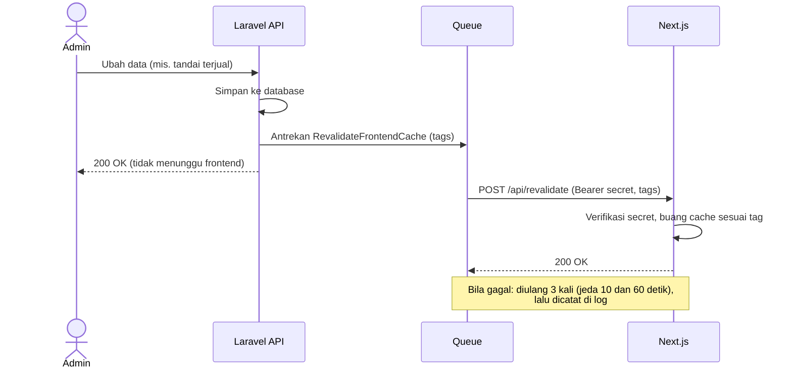

# PakeLagi — Kontrak Integrasi Backend dan Frontend

| | |
|---|---|
| **Versi dokumen** | 0.1 (Draft) |
| **Tanggal** | 5 Oktober 2026 |
| **Dokumen terkait** | [Requirements](./requirements.md) · [User Flow](./user-flow.md) |

Dokumen ini adalah kesepakatan antara repositori `pakelagi-api` (backend) dan `pakelagi-web` (frontend Next.js) tentang cara menjaga halaman publik tetap segar. Bagian frontend baru dikerjakan setelah backend selesai, jadi dokumen ini menjadi acuannya.

## 1. Latar Belakang

Next.js menyimpan (cache) hasil pemanggilan API agar halaman cepat dibuka. Akibatnya, setelah admin mengubah data, halaman publik bisa masih menampilkan data lama. Contohnya: produk sudah ditandai terjual, tetapi halamannya masih menampilkan "tersedia". Untuk barang yang stoknya satu, ini tidak boleh terjadi.

Solusinya: setiap kali data berubah, backend memberi tahu frontend lewat sebuah webhook (permintaan HTTP) agar bagian cache yang terdampak dibuang dan diambil ulang.

## 2. Alur



## 3. Permintaan dari Backend

| Bagian | Nilai |
|---|---|
| Method dan URL | `POST` ke `FRONTEND_REVALIDATE_URL` |
| Header otentikasi | `Authorization: Bearer <REVALIDATE_SECRET>` |
| Header lain | `Content-Type: application/json`, `Accept: application/json` |
| Body | `{"tags": ["catalog", "product:kemeja-flanel"]}` |
| Respons sukses | Status 2xx apa pun |
| Respons gagal | Status non-2xx atau timeout (5 detik) akan diulang |

## 4. Tag Cache

Backend tidak mengirim alamat halaman (path), melainkan **nama tag** yang menggambarkan data. Dengan begitu, backend tidak perlu tahu struktur URL frontend.

| Tag | Arti | Dikirim saat |
|---|---|---|
| `catalog` | Semua daftar produk (katalog, pencarian, wishlist) | Produk dibuat, diubah, dihapus, berganti status, ditandai terjual, atau fotonya berubah; kategori berubah |
| `product:{slug}` | Halaman detail satu produk | Perubahan pada produk dengan slug tersebut |
| `categories` | Daftar kategori dan info kategori di halaman lain | Kategori dibuat, diubah, atau dihapus |

**Aturan pemberian tag di frontend** (pada pemanggilan `fetch` ke API):

| Pemanggilan API | Tag yang dipasang |
|---|---|
| `GET /products` (daftar, filter, pencarian, wishlist) | `catalog` |
| `GET /products/{slug}` | `product:{slug}` dan `categories` |
| `GET /categories` | `categories` |

Detail produk juga memakai tag `categories` karena halaman itu menampilkan nama kategori. Slug produk tidak pernah berubah, sehingga tag `product:{slug}` stabil.

## 5. Tanggung Jawab Frontend

Frontend menyediakan satu endpoint (rencana: `POST /api/revalidate`) yang:

1. Memeriksa header `Authorization` terhadap secret bersama, dengan perbandingan waktu-konstan (*timing-safe*). Bila salah, balas `401`.
2. Memvalidasi body: `tags` harus array berisi teks, dengan batas jumlah dan panjang wajar, dan hanya menerima tag dengan awalan yang dikenal (`catalog`, `categories`, `product:`).
3. Memanggil fungsi revalidasi tag milik Next.js untuk setiap tag. Nama fungsi dan argumennya mengikuti dokumentasi versi Next.js yang dipakai, sehingga diperiksa saat frontend dibangun.
4. Membalas `200`.

## 6. Perilaku Backend

- Pemberitahuan dikirim lewat **queue**, jadi permintaan admin tidak menunggu frontend dan tidak gagal bila frontend sedang mati.
- Job baru dikirim **setelah transaksi database selesai (commit)**, supaya frontend tidak mengambil data lama saat database belum menyimpan perubahan.
- Gagal diulang maksimal 3 kali dengan jeda 10 dan 60 detik. Bila tetap gagal, dicatat sebagai peringatan di log dan masuk ke tabel `failed_jobs`.
- Bila `FRONTEND_REVALIDATE_URL` atau `REVALIDATE_SECRET` kosong, fitur ini mati (tidak ada job yang dikirim). Cocok untuk pengembangan tanpa frontend.
- Menandai ulang produk yang sudah terjual, atau mengubah status ke nilai yang sama, tidak mengirim pemberitahuan karena tidak ada perubahan data.

## 7. Konfigurasi

### Revalidasi

| Variabel | Backend | Frontend | Keterangan |
|---|---|---|---|
| `FRONTEND_REVALIDATE_URL` | Ya | | Lokal: `http://localhost:3000/api/revalidate`. Produksi: `https://pakelagi.works/api/revalidate` |
| `REVALIDATE_SECRET` | Ya | Ya | Teks acak minimal 32 byte, **sama di kedua sisi**, tidak boleh masuk Git |

Contoh membuat secret:

```bash
php -r "echo bin2hex(random_bytes(32)), PHP_EOL;"
```

### Autentikasi dan CORS (nilai produksi, diisi saat deploy)

| Variabel | Nilai |
|---|---|
| `FRONTEND_URL` | `https://pakelagi.works` |
| `SANCTUM_STATEFUL_DOMAINS` | `pakelagi.works` |
| `SESSION_DOMAIN` | `.pakelagi.works` |
| `SESSION_SECURE_COOKIE` | `true` |

Frontend dan API harus berada di domain induk yang sama (`pakelagi.works` dan `api.pakelagi.works`) agar cookie sesi login admin berlaku untuk keduanya.

## 8. Catatan Keamanan

- URL revalidasi di produksi wajib HTTPS.
- Secret tidak boleh ditulis di kode atau di repositori; simpan di `.env` backend dan variabel lingkungan frontend.
- Endpoint revalidasi frontend tidak boleh dapat dipanggil tanpa secret, karena kalau tidak, siapa pun bisa memaksa cache dibuang berulang kali dan membebani API.

## 9. Syarat Menjalankan Queue

Driver queue yang dipilih adalah `database`, jadi job disimpan di tabel `jobs` dan harus diambil oleh proses pekerja (*worker*):

- **Lokal:** jalankan `php artisan queue:listen` di terminal terpisah, atau atur `QUEUE_CONNECTION=sync` di `.env` agar job berjalan langsung tanpa pekerja.
- **Produksi:** pekerja harus selalu berjalan. Di VPS memakai Supervisor; di shared hosting biasanya lewat cron. Pilihan ini bergantung pada hosting yang dipakai (lihat pertanyaan terbuka di [Requirements](./requirements.md)).