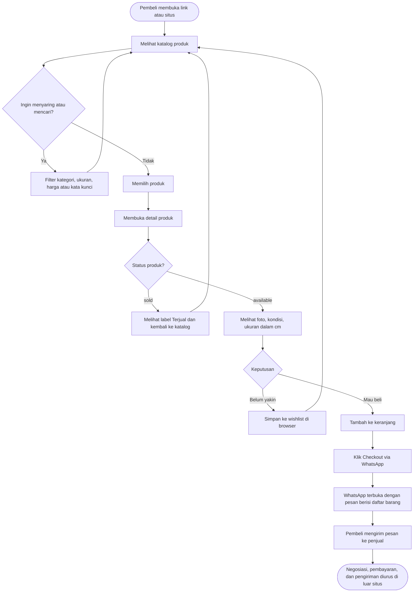
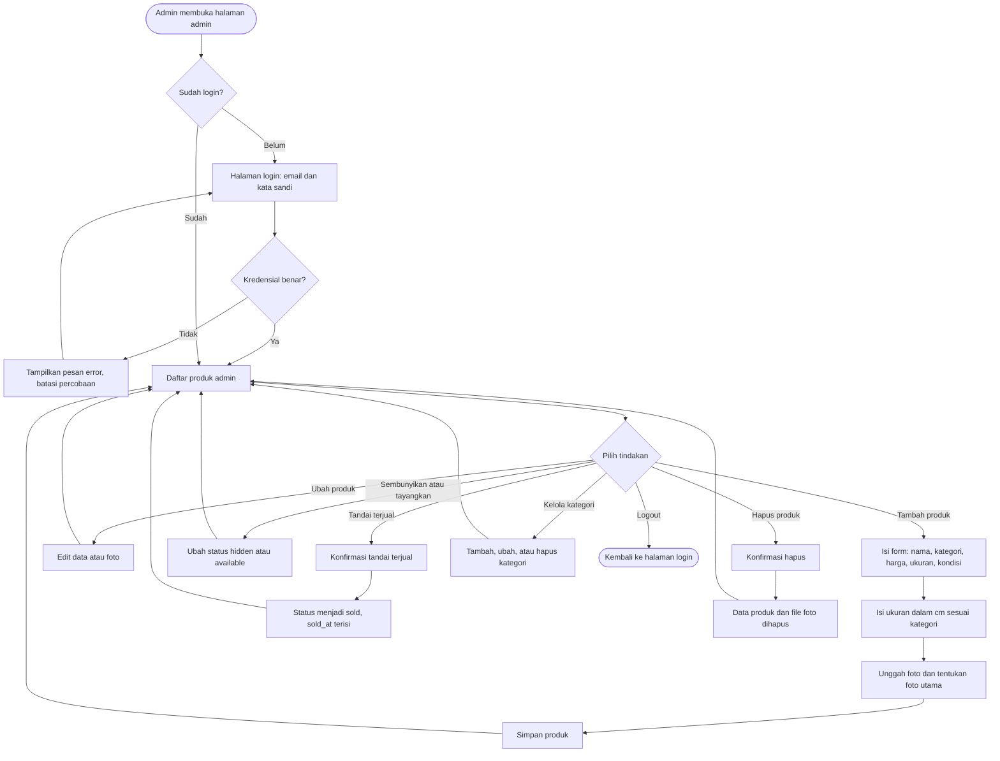
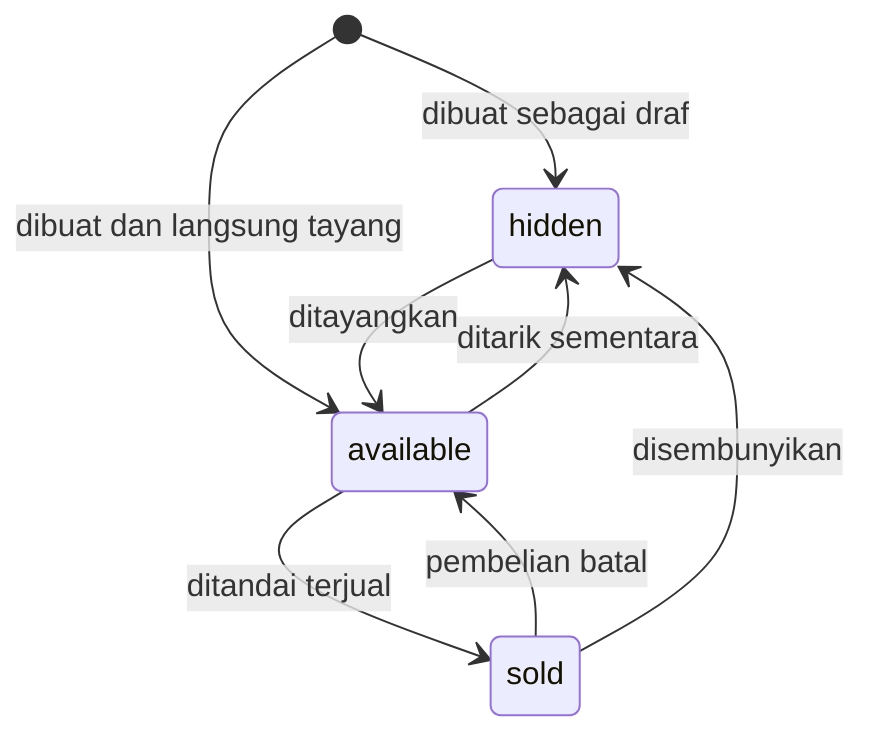
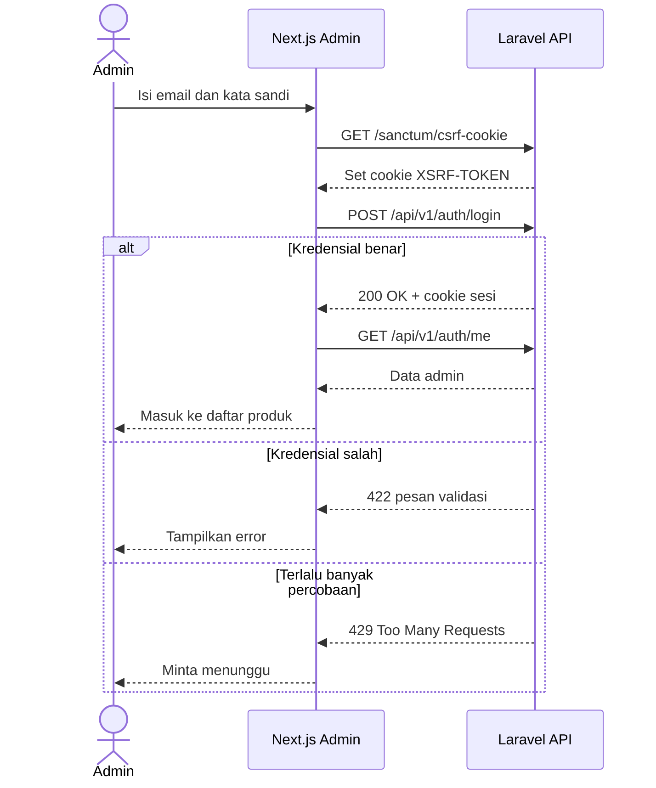
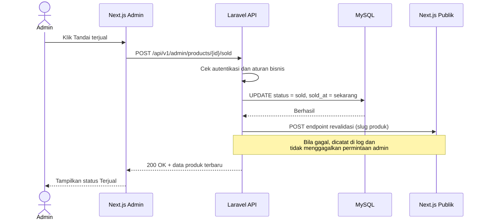
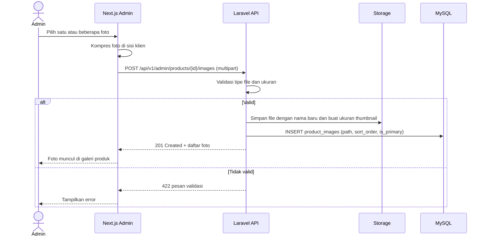
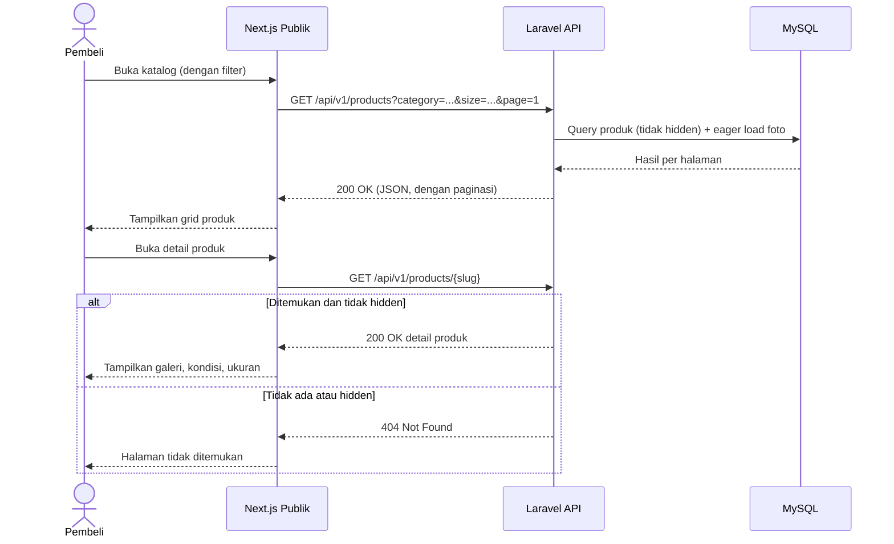

# PakeLagi API — User Flow

| | |
|---|---|
| **Versi dokumen** | 0.1 (Draft) |
| **Tanggal** | 4 Oktober 2026 |
| **Dokumen terkait** | [Requirements](./requirements.md) · [ERD](./erd.md) |

Dokumen ini menggambarkan alur penggunaan dari sudut pandang **pembeli** dan **admin**, serta alur teknis antara frontend (Next.js) dan API (Laravel). Diagram memakai Mermaid, yang tampil otomatis di GitHub.

## 1. Alur Pembeli (Tanpa Akun)

Pembeli menjelajah katalog, menyimpan barang ke wishlist atau keranjang (disimpan di browser), lalu menyelesaikan pesanan lewat WhatsApp. Backend hanya dipakai untuk membaca data produk.

**Catatan:**
- Wishlist dan keranjang disimpan di browser (localStorage). Saat membuka wishlist, frontend memanggil `GET /products?slugs=a,b,c`; produk yang sudah terjual tetap tampil dengan label, produk yang sudah tidak ada diabaikan.
- Pembeli tidak membuat akun dan tidak membayar lewat situs pada versi 1.

## 2. Alur Admin

Admin masuk, mengelola produk, dan menandai barang terjual setelah transaksi selesai di WhatsApp.

**Catatan:**
- Penghapusan kategori ditolak bila kategori masih punya produk.
- Setiap perubahan produk memicu revalidasi cache di frontend (lihat bagian 5).

## 3. Siklus Hidup Produk

Perilaku di API publik: `available` tampil normal, `sold` tetap bisa dibuka lewat slug dengan label terjual, `hidden` tidak pernah tampil.

## 4. Alur Teknis: Login Admin

Direncanakan memakai Sanctum berbasis cookie (SPA), sehingga frontend dan API perlu berada di domain induk yang sama (`pakelagi.works` dan `api.pakelagi.works`).

## 5. Alur Teknis: Tandai Terjual dan Revalidasi Cache

Next.js menyimpan cache halaman produk. Tanpa revalidasi, halaman publik bisa masih menampilkan "tersedia" setelah barang terjual.

## 6. Alur Teknis: Unggah Foto Produk

## 7. Alur Teknis: Membuka Katalog dan Detail Produk

