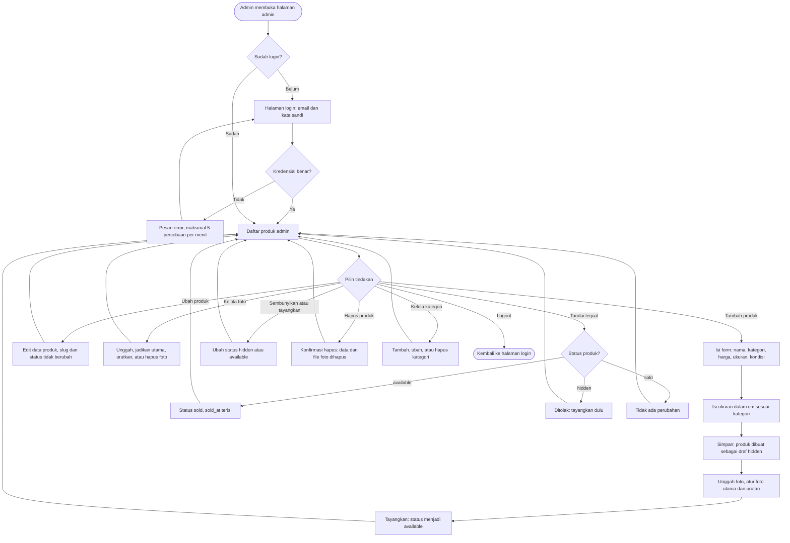
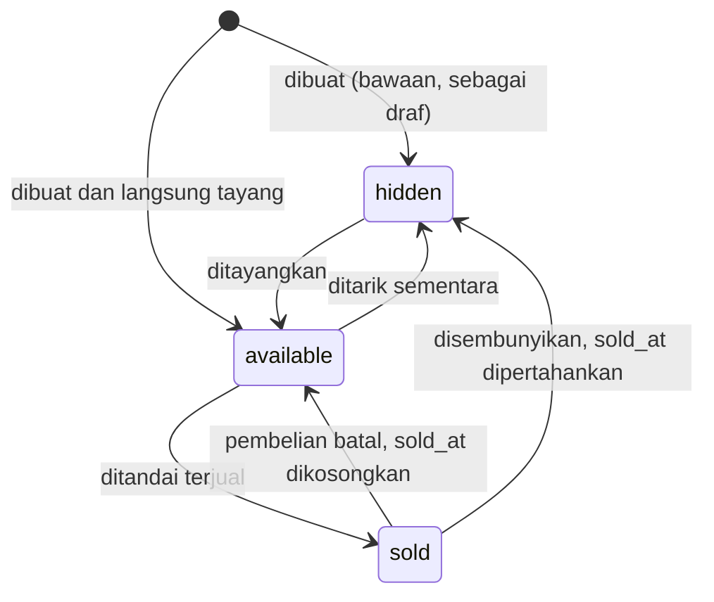
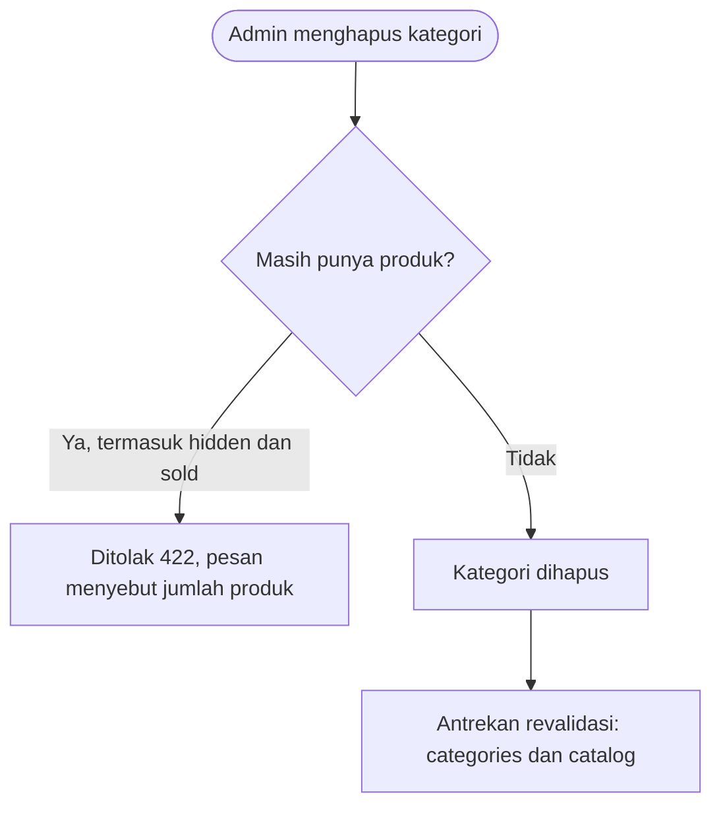
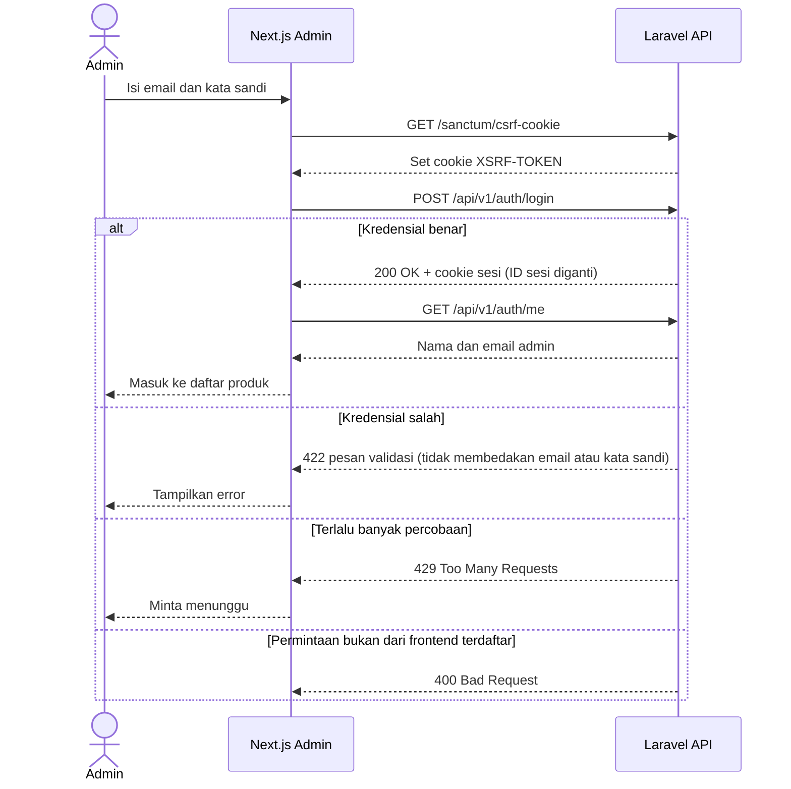
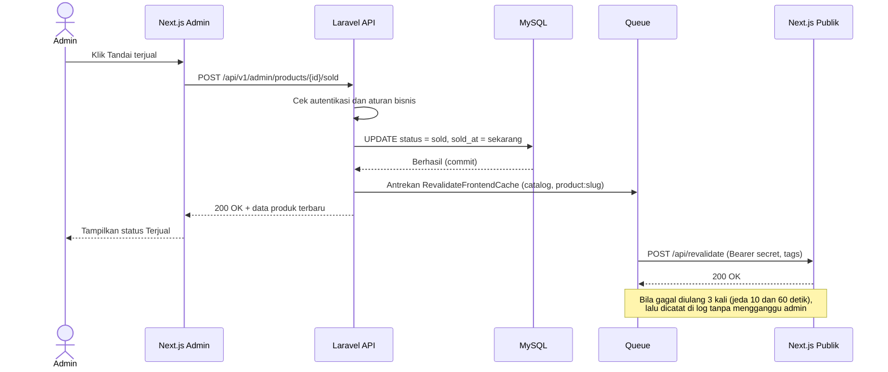
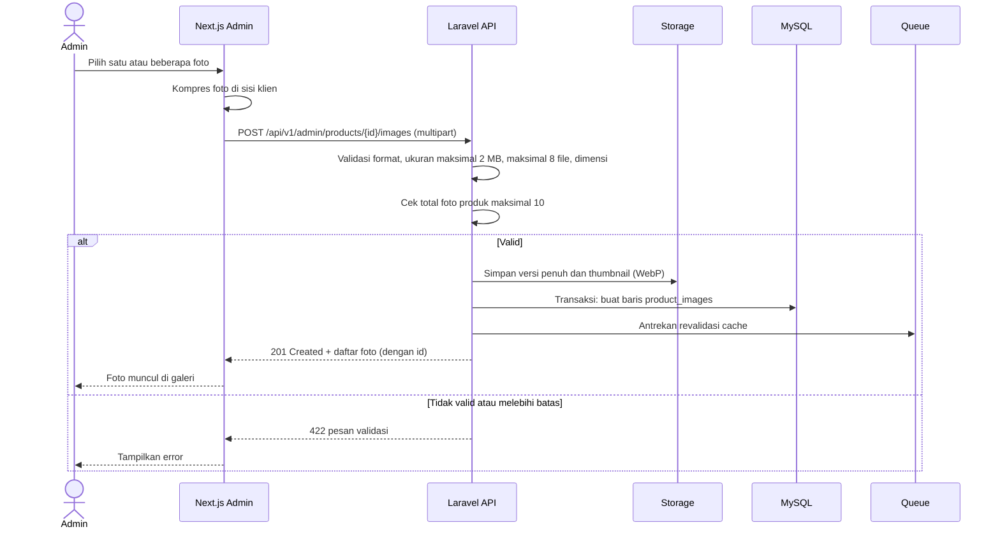
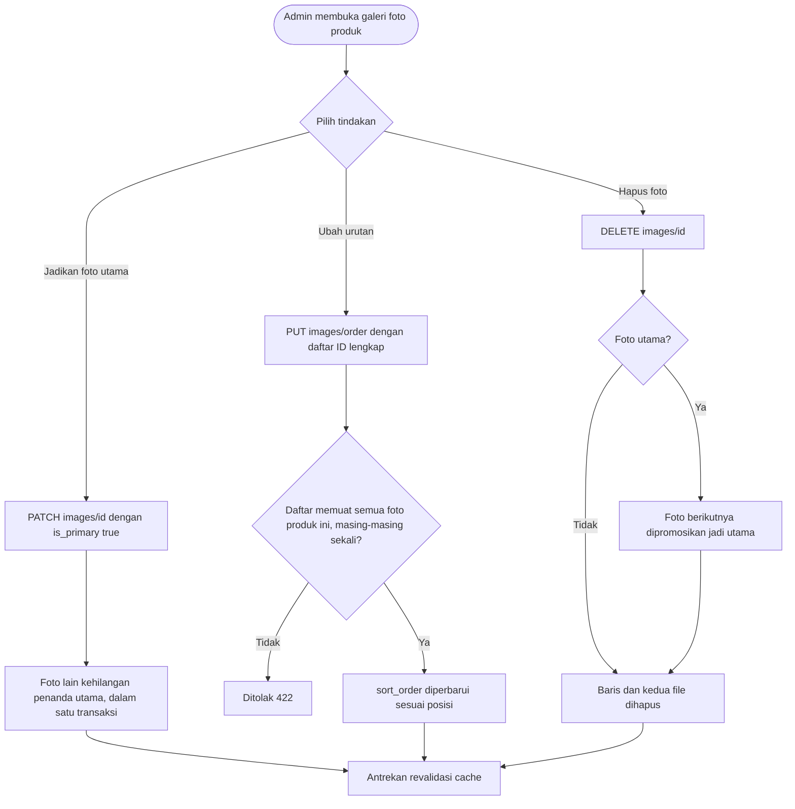
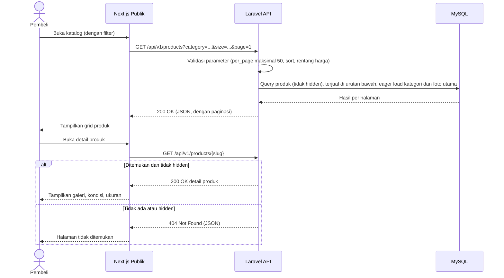

# PakeLagi API — User Flow

| | |
|---|---|
| **Versi dokumen** | 0.2 (Draft) |
| **Tanggal** | 5 Oktober 2026 |
| **Dokumen terkait** | [Requirements](./requirements.md) · [ERD](./erd.md) · [Integrasi Frontend](./frontend-integration.md) |

Dokumen ini menggambarkan alur penggunaan dari sudut pandang **pembeli** dan **admin**, serta alur teknis antara frontend (Next.js) dan API (Laravel). Diagram memakai Mermaid, yang tampil otomatis di GitHub.

## 1. Alur Pembeli (Tanpa Akun)

Pembeli menjelajah katalog, menyimpan barang ke wishlist atau keranjang (disimpan di browser), lalu menyelesaikan pesanan lewat WhatsApp. Backend hanya dipakai untuk membaca data produk.

**Catatan:**
- Katalog menampilkan produk tersedia lebih dulu; produk terjual berada di urutan bawah dengan label Terjual. Produk tersembunyi (`hidden`) tidak pernah tampil, dan membuka linknya menghasilkan halaman tidak ditemukan.
- Wishlist dan keranjang disimpan di browser (localStorage). Saat membuka wishlist, frontend memanggil `GET /products?slugs=a,b,c`; produk yang sudah terjual tetap tampil dengan label, sedangkan produk yang sudah dihapus atau disembunyikan diabaikan.
- Pembeli tidak membuat akun dan tidak membayar lewat situs pada versi 1.
- Dua pembeli bisa menghubungi untuk barang yang sama; admin yang memutuskan dan menandai terjual.

## 2. Alur Admin

Admin masuk, menyiapkan produk (dibuat sebagai draf, diberi foto, lalu ditayangkan), dan menandai barang terjual setelah transaksi selesai di WhatsApp.

**Catatan:**
- Produk yang baru dibuat berstatus draf (`hidden`) karena fotonya belum ada; admin menayangkannya setelah siap. Admin juga boleh memilih langsung `available` saat membuat.
- Setiap perubahan data memicu pemberitahuan revalidasi ke frontend (lihat bagian 6).
- Maksimal 5 percobaan login per menit untuk kombinasi email dan IP yang sama.

## 3. Siklus Hidup Produk

Perilaku di API publik: `available` tampil normal, `sold` tetap bisa dibuka lewat slug dengan label terjual (dan berada di urutan bawah katalog), `hidden` tidak pernah tampil. Transisi `hidden` → `sold` tidak diizinkan.

## 4. Alur Kategori

Kategori dapat ditambah dan diubah kapan saja. Slug tidak berubah setelah dibuat, sedangkan penghapusan dibatasi.

Mengubah `measurement_fields` suatu kategori tidak mengubah ukuran produk yang sudah ada; aturan kecocokan ukuran baru diperiksa saat sebuah produk disimpan.

## 5. Alur Teknis: Login Admin

Memakai Sanctum berbasis cookie (SPA), sehingga frontend dan API perlu berada di domain induk yang sama (`pakelagi.works` dan `api.pakelagi.works`).

## 6. Alur Teknis: Tandai Terjual dan Revalidasi Cache

Next.js menyimpan cache halaman produk. Tanpa revalidasi, halaman publik bisa masih menampilkan "tersedia" setelah barang terjual. Pemberitahuan dikirim lewat queue, setelah database menyimpan perubahan, sehingga admin tidak menunggu frontend.

Operasi yang tidak mengubah data (misalnya menandai ulang produk yang sudah terjual, atau mengubah status ke nilai yang sama) tidak mengantrekan pemberitahuan. Daftar tag dan kontrak lengkap ada di [Integrasi Frontend](./frontend-integration.md).

## 7. Alur Teknis: Unggah Foto Produk

Foto pertama yang diunggah untuk sebuah produk otomatis menjadi foto utama. Bila pemrosesan atau penyimpanan data gagal di tengah jalan, file yang sudah tersimpan dihapus kembali agar tidak ada file yatim di storage.

## 8. Alur Teknis: Mengelola Foto yang Sudah Ada

Foto yang bukan milik produk di URL (misalnya `/products/1/images/99` padahal foto 99 milik produk lain) dibalas 404.

## 9. Alur Teknis: Membuka Katalog dan Detail Produk

Parameter yang tidak valid (misalnya `per_page=100` atau `sort=acak`) dibalas 422 dengan rincian per parameter, dan permintaan yang melebihi 60 kali per menit dibalas 429.